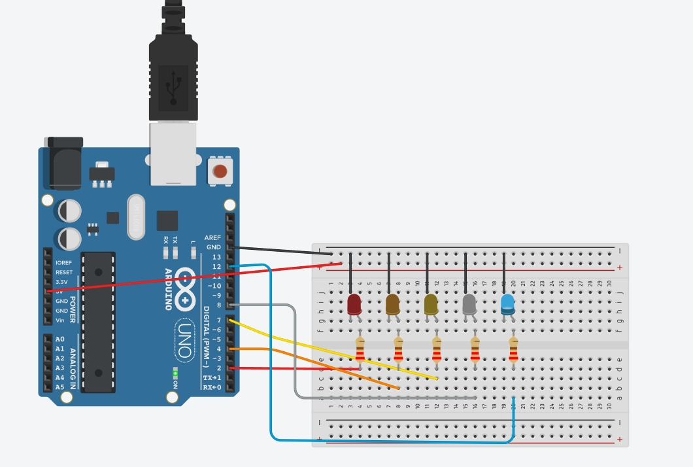
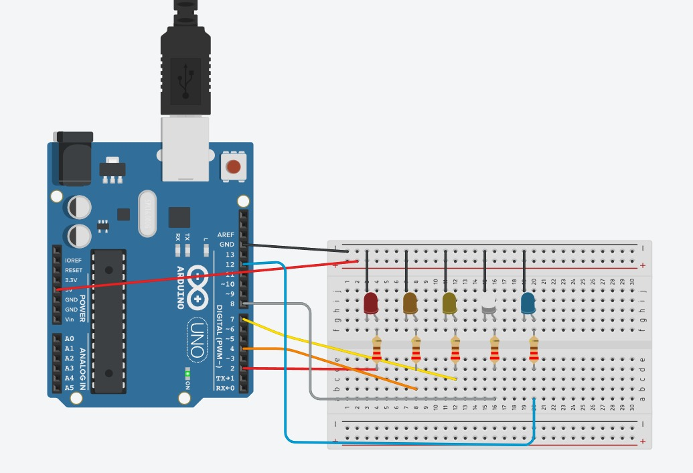
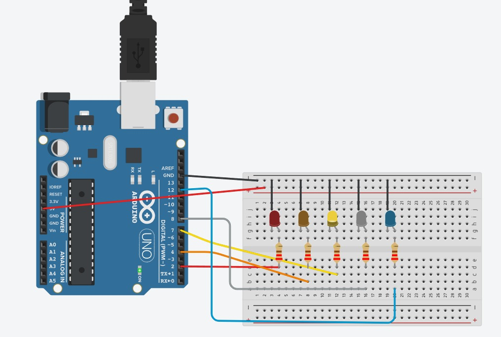
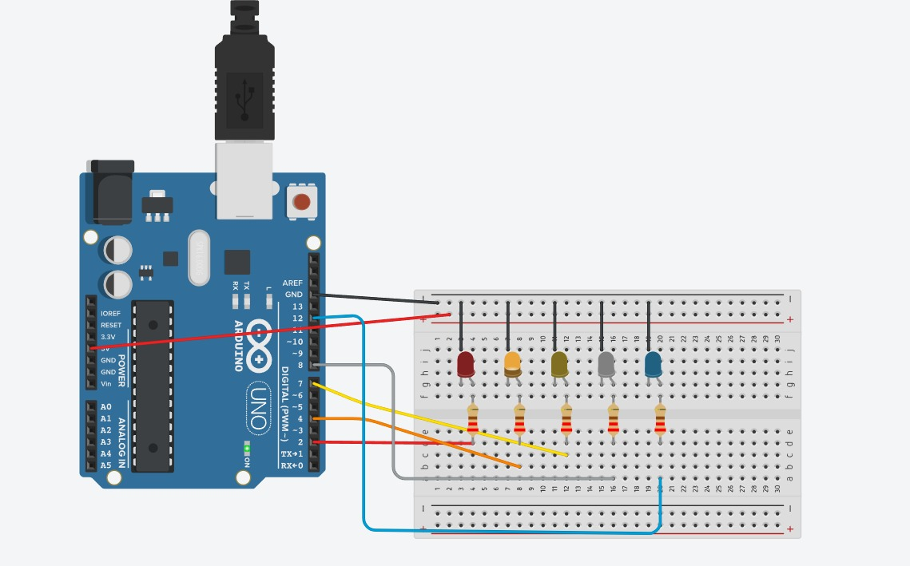
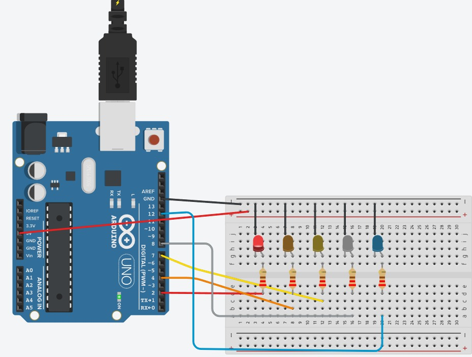

# Projeto 1

Este Arduino cicla 5 cores acendendo e apagando durante três segundos cada LED da direita para a esquerda.

---

## Imagens







---

## Programação

```cpp
int wait = 3000;

void setup()
{
  pinMode(12, OUTPUT);
  pinMode(8, OUTPUT);
  pinMode(7, OUTPUT);
  pinMode(4, OUTPUT);
  pinMode(2, OUTPUT);
}

void loop()
{
  digitalWrite(12, HIGH);
  delay(wait);
  digitalWrite(12, LOW);
  
  digitalWrite(8, HIGH);
  delay(wait);
  digitalWrite(8, LOW);
  
  digitalWrite(7, HIGH);
  delay(wait);
  digitalWrite(7, LOW);
  
  digitalWrite(4, HIGH);
  delay(wait);
  digitalWrite(4, LOW);
  
  digitalWrite(2, HIGH);
  delay(wait);
  digitalWrite(2, LOW);
}

