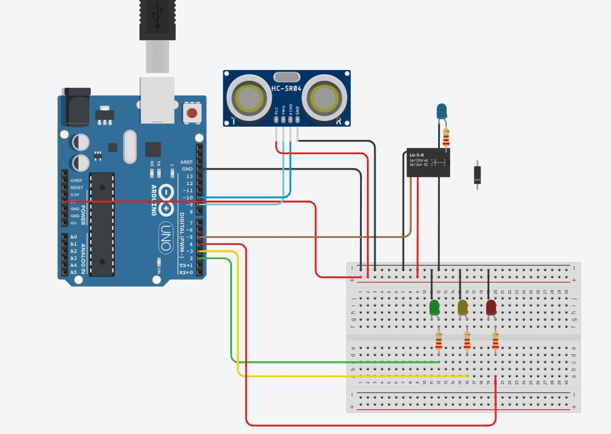
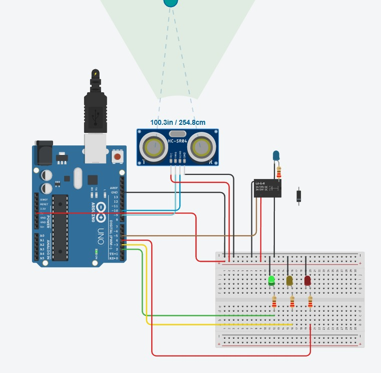
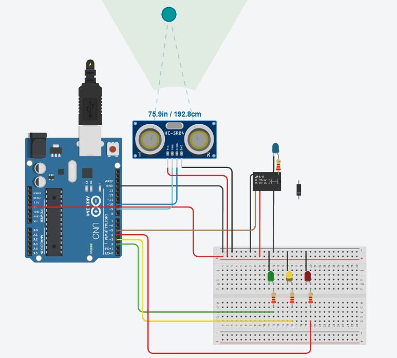
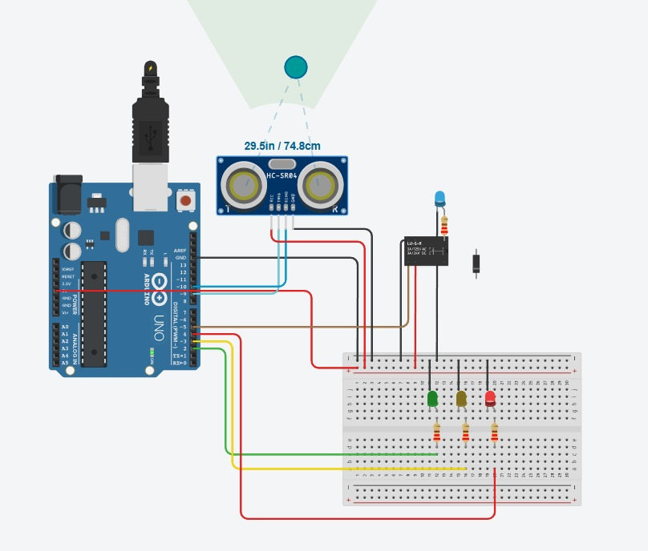

# Projeto 2

## Medidor Ultrassônico de Nível de Tanque

Simule um tanque com três níveis de altura utilizando um sensor ultrassônico.

### Funcionamento do sistema

1. **Nível 1 – Vazio:** acende o **LED verde**;  
2. **Nível 2 – Médio:** acende o **LED amarelo**;  
3. **Nível 3 – Cheio:** acende o **LED vermelho** e aciona uma **bomba** (use um relé e um circuito separado para representar o sistema da bomba).  

A bomba deve permanecer **ligada enquanto o tanque estiver cheio** e **desligar automaticamente quando o nível voltar a vazio**.

---

## Imagens






---

## Programação

```cpp
// Pinos
const int trigPin = 9;
const int echoPin = 10;
const int ledVerde = 2;
const int ledAmarelo = 3;
const int ledVermelho = 4;
const int releBomba = 5;

// Variáveis
long duracao;
int distancia;

void setup() {
  pinMode(trigPin, OUTPUT);
  pinMode(echoPin, INPUT);
  pinMode(ledVerde, OUTPUT);
  pinMode(ledAmarelo, OUTPUT);
  pinMode(ledVermelho, OUTPUT);
  pinMode(releBomba, OUTPUT);

  digitalWrite(ledVerde, LOW);
  digitalWrite(ledAmarelo, LOW);
  digitalWrite(ledVermelho, LOW);
  digitalWrite(releBomba, LOW);

  Serial.begin(9600);
}

void loop() {
  digitalWrite(trigPin, LOW);
  delayMicroseconds(2);
  digitalWrite(trigPin, HIGH);
  delayMicroseconds(10);
  digitalWrite(trigPin, LOW);

  duracao = pulseIn(echoPin, HIGH);
  distancia = duracao * 0.034 / 2; 

  Serial.print("Distância: ");
  Serial.println(distancia);

  digitalWrite(ledVerde, LOW);
  digitalWrite(ledAmarelo, LOW);
  digitalWrite(ledVermelho, LOW);
  digitalWrite(releBomba, LOW);

  if(distancia > 250) { 
    digitalWrite(ledVerde, HIGH);
  } else if(distancia > 100) { 
    digitalWrite(ledAmarelo, HIGH);
  } else { 
    digitalWrite(ledVermelho, HIGH);
    digitalWrite(releBomba, HIGH);
  }

  delay(500);
}

