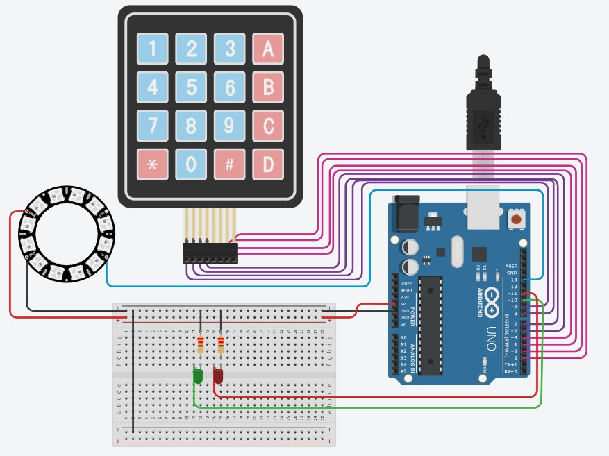

# Projeto 3

## Jogo com NeoRing e Teclado 4x4

Este projeto utiliza um **NeoRing de 12 LEDs (NEORING12)** para acender uma quantidade **aleatória de luzes**.  
O jogador deve selecionar no **teclado 4x4** o número de LEDs acesos.  
- Se a resposta estiver **correta**, acende um **LED verde**.  
- Se estiver **errada**, acende um **LED vermelho**.

---

## Imagens



---

## Programação

```cpp
#include <Adafruit_NeoPixel.h>
#include <Keypad.h>

#define PIN_NEOPIXEL 13
#define NUMPIXELS 12

#define LED_VERDE 10
#define LED_VERMELHO 11

Adafruit_NeoPixel pixels(NUMPIXELS, PIN_NEOPIXEL, NEO_GRB + NEO_KHZ800);

// Teclado 4x4
const byte ROWS = 4;
const byte COLS = 4;
char keys[ROWS][COLS] = {
  {'1','2','3','A'},
  {'4','5','6','B'},
  {'7','8','9','C'},
  {'*','0','#','D'}
};
byte rowPins[ROWS] = {9, 8, 7, 6};
byte colPins[COLS] = {5, 4, 3, 2};
Keypad keypad = Keypad(makeKeymap(keys), rowPins, colPins, ROWS, COLS);

int numAcesos;

void setup() {
  pixels.begin();
  pixels.show();
  
  pinMode(LED_VERDE, OUTPUT);
  pinMode(LED_VERMELHO, OUTPUT);
  
  randomSeed(analogRead(0));
  Serial.begin(9600);
}

void loop() {
  // Gira os LEDs 3 vezes
  for (int i = 0; i < 3; i++) {
    for (int j = 0; j < NUMPIXELS; j++) {
      pixels.setPixelColor(j, pixels.Color(50, 50, 50)); // luz fraca
      pixels.show();
      delay(100);
      pixels.setPixelColor(j, 0);
    }
  }

  // Acende quantidade aleatória de LEDs
  numAcesos = random(1, NUMPIXELS + 1);
  Serial.print("Número de LEDs acesos: ");
  Serial.println(numAcesos); // só para debug

  // Acende LEDs aleatórios (VERDES)
  for (int i = 0; i < numAcesos; i++) {
    int idx;
    do {
      idx = random(NUMPIXELS);
    } while (pixels.getPixelColor(idx) != 0); // evita repetir
    pixels.setPixelColor(idx, pixels.Color(0, 255, 0)); // verde
  }
  pixels.show();

  // Espera usuário digitar
  int entrada = 0;
  String temp = "";
  while (true) {
    char key = keypad.getKey();
    if (key) {
      if (key >= '0' && key <= '9') {
        temp += key;
        Serial.print(key);
      } else if (key == '#') { // confirma
        entrada = temp.toInt();
        break;
      }
    }
  }
  Serial.println();

  // Verifica acerto
  if (entrada == numAcesos) {
    digitalWrite(LED_VERDE, HIGH);
    digitalWrite(LED_VERMELHO, LOW);
  } else {
    digitalWrite(LED_VERDE, LOW);
    digitalWrite(LED_VERMELHO, HIGH);
  }

  delay(3000); // tempo para ver resultado
  digitalWrite(LED_VERDE, LOW);
  digitalWrite(LED_VERMELHO, LOW);

  // Reseta NeoPixel
  pixels.clear();
  pixels.show();
  delay(1000);
}

